# OltraHMS Frontend

This is the frontend client for the OltraHMS application, built with React, TypeScript, and Vite.

## Quick Start

Please refer to the root [README.md](../README.md) for full project setup and documentation.

## Commands

- `npm run dev`: Start development server
- `npm run build`: Build for production
- `npm run lint`: Run ESLint
- `npx playwright test`: Run E2E tests

## Recent Updates (June 2026)

### Silent Token Refresh

- The access token is short-lived (15 min). The client now stores the refresh token on login and transparently exchanges it for a new access token on a `401`, then retries the original request — staff are no longer logged out mid-task.
- Implemented as a reusable interceptor `installAuthInterceptors()` in `src/lib/api.ts`, installed on both the shared `api` instance and the default `axios` instance (most pages call `axios` directly), wired up in `src/main.tsx`.
- Users are only redirected to `/login` when the refresh token itself is invalid or expired.

### Offline Capture for Front-Desk Flows

- The two most time-critical write flows now save locally during connectivity/power outages and replay automatically on reconnect:
  - **Receptionist check-in & walk-in** (`src/services/queue.service.ts`, `src/pages/receptionist/QueueDashboard.tsx`)
  - **Nurse triage + vitals** (`src/pages/nurse/TriageDashboard.tsx`)
- New helper `submitWithOfflineFallback()` in `src/services/offlineStorage.ts`: online requests go through the authenticated Axios instance; a genuine network failure (or `navigator.onLine === false`) queues the request in IndexedDB and returns `{ queued: true }`. Real server errors are surfaced, not queued.
- Queued requests are replayed by `syncAllPendingData()` on reconnect using the correct API base URL and a fresh auth token. Queued actions show an *"Offline — saved, will sync when connection returns"* toast.
- Other write flows (patient registration, appointment booking, etc.) still require connectivity.

## Recent Fixes (April 2026)

### TypeError Fixes

- Fixed `A.result?.toLowerCase is not a function` errors in filtering operations
- Added `String()` conversions before `toLowerCase()` calls to handle `null`/`undefined` values
- Affected files:

  - `src/pages/doctor/MedicalRecords.tsx`
  - `src/pages/finance/ServiceManagement.tsx`
  - `src/pages/patient/Records.tsx`
  - `src/pages/finance/InsuranceClaims.tsx`

## New Features (March 2025)

### PWA Support

- Offline-first capability with Service Worker
- IndexedDB for local data storage
- Background Sync for offline queue operations
- Installable as native app

### Queue Management

- Real-time queue updates via Socket.io
- Socket service: `src/services/socketService.ts`
- Offline storage: `src/services/offlineStorage.ts`
- Print service for thermal printers: `src/services/printService.ts`

### Key Services

- `socketService.ts`: Real-time queue updates
- `offlineStorage.ts`: IndexedDB wrapper for offline data
- `printService.ts`: Thermal printer integration
- `pwaRegistration.ts`: Service Worker management

## Screenshots

### Authentication

#### Login

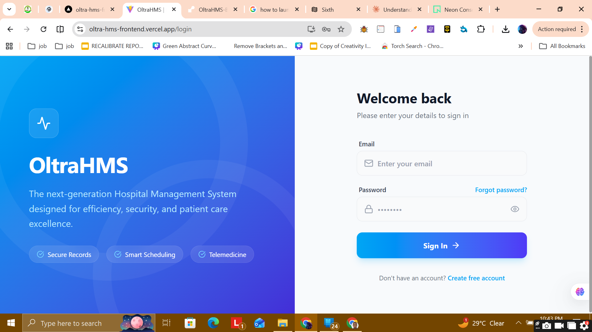

#### Register

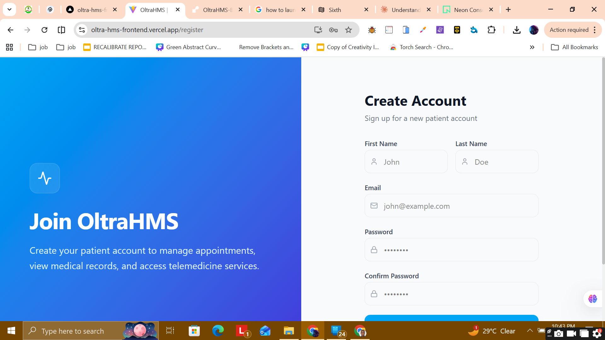

### Dashboards

#### Patient Dashboard

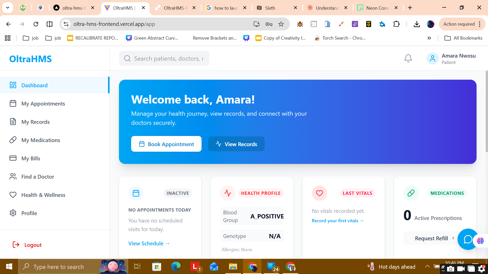

#### Receptionist Dashboard

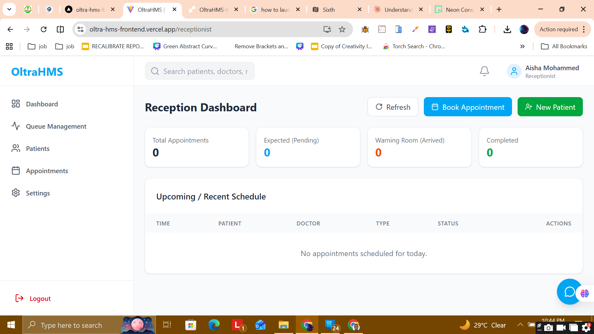

#### Nurse Dashboard

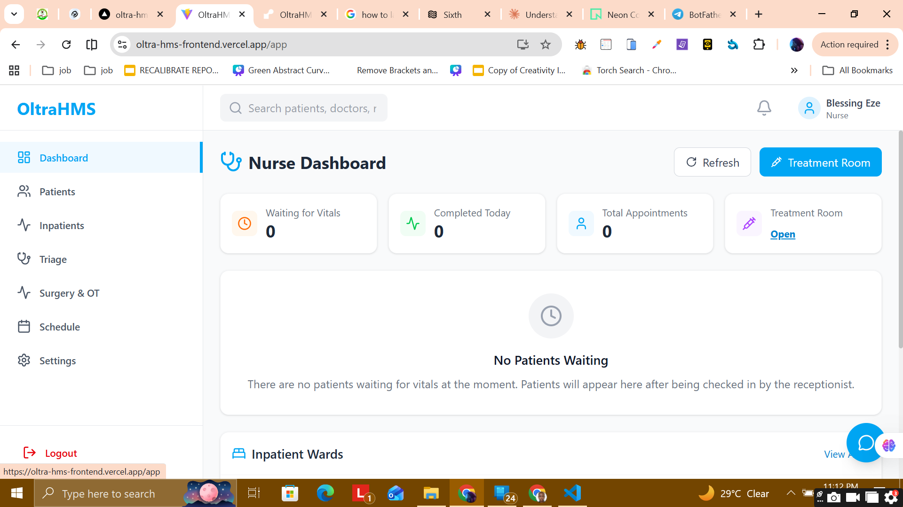

#### Admin Dashboard

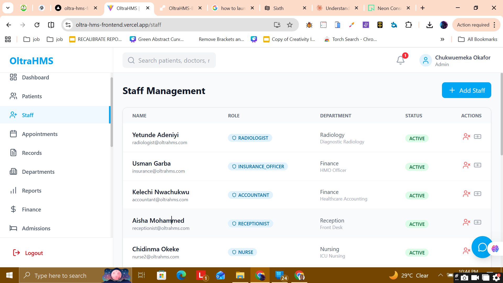

### Clinical and Operations Modules

#### Appointments

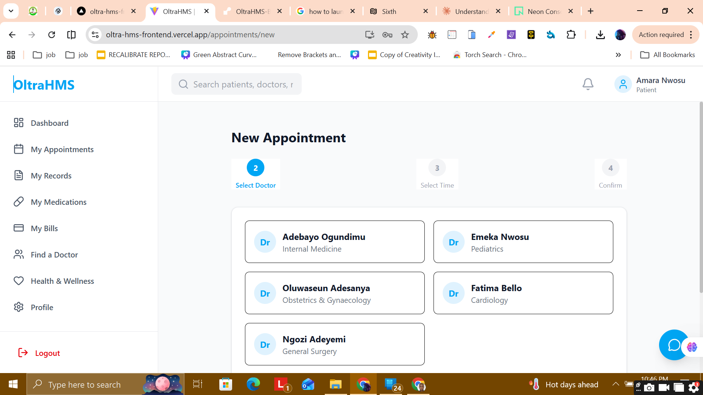

#### Doctor Module

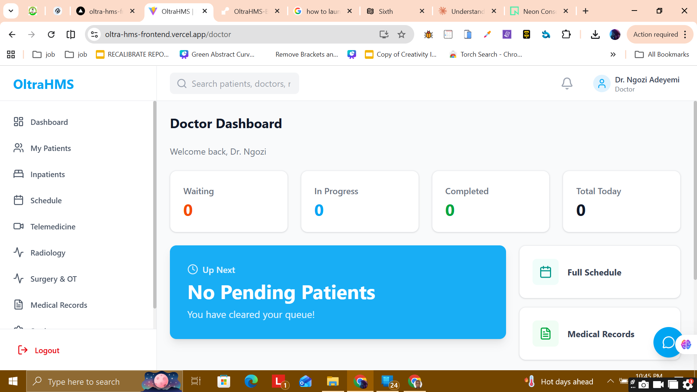

#### Nurse Module

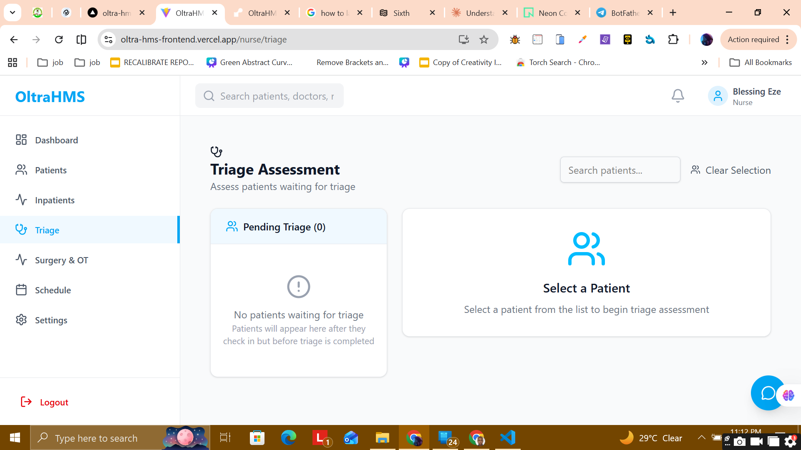

#### Laboratory Module

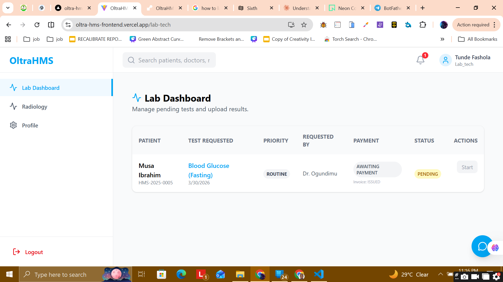

#### Pharmacy Module

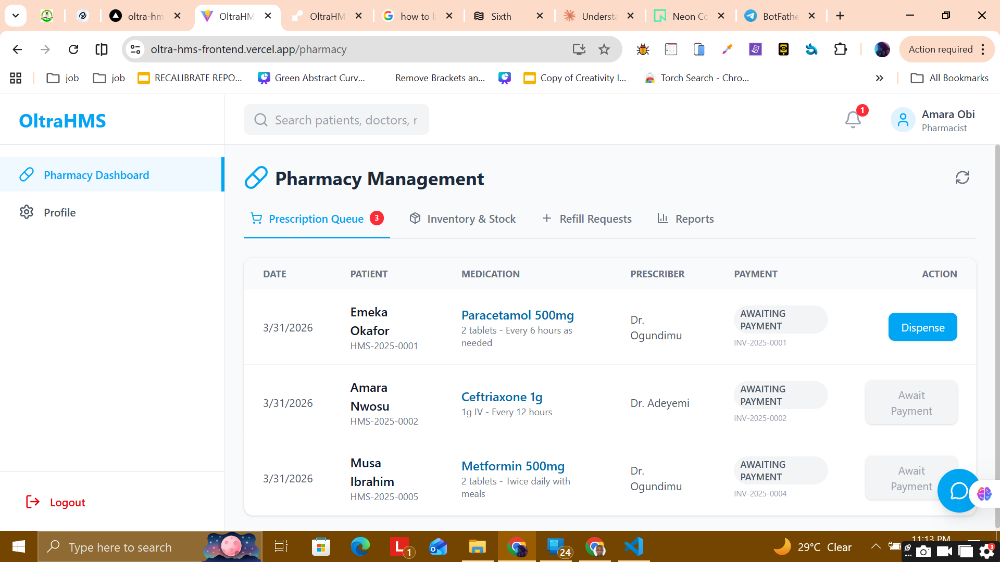

#### Finance Module

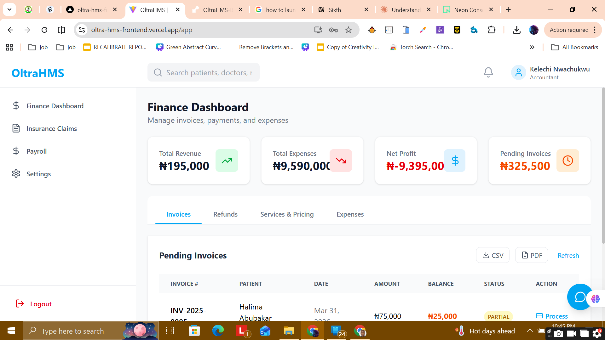
